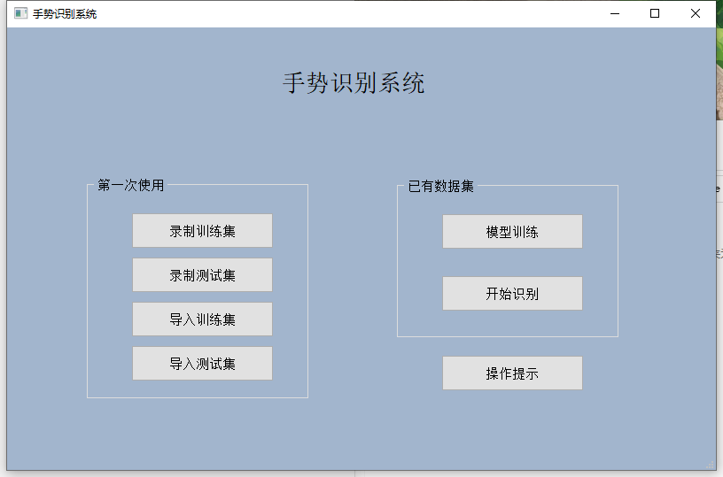
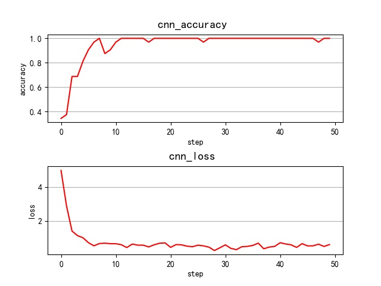
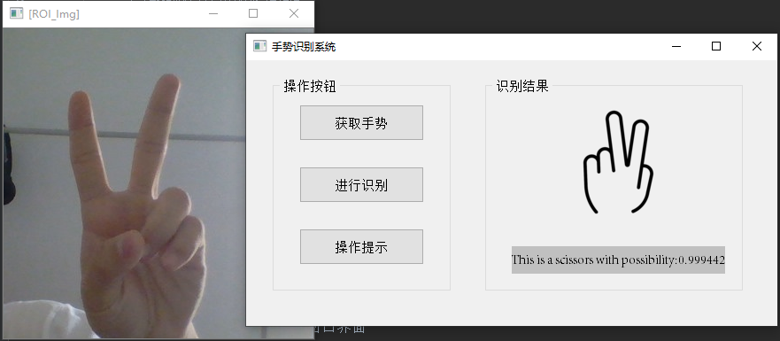
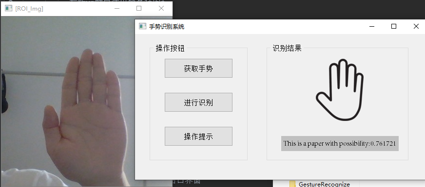
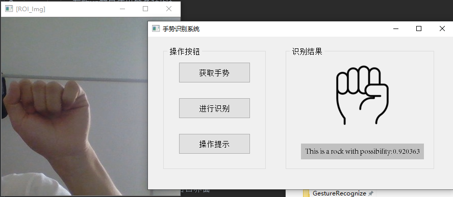
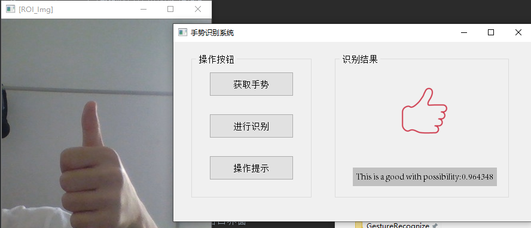

# 手势识别系统
主要功能：自建数据集，支持识别5种手势：剪刀、布、石头、OK、GOOD，可部署到嵌入式设备。
 使用技术：框架tensorflow、图形化界面pyqt5、卷积模型AlexNet

# 项目文件
* `data`：数据集文件
  * `train`：存放训练集图片
  * `test`：存放测试集图片
  * `testImage`：存放用于检测的图片
* `ui`：UI文件
  * `MainWindow.py`：主窗口
  * `StartRecognize.py`：识别窗口
* `ges_ico`：存放UI窗口使用的各种图标。
* `checkpoint`：存放训练的CNN网络的模型。
* `src`：源码
  * `MainWindow.py`：主窗口的界面。
  * `MainWindow_Controller.py`：主窗口界面触发的函数。
  * `StartRecognize.py`：识别窗口的界面。
  * `StartRecognize_Controller.py`：识别窗口界面触发的函数。
  * `MakeImage.py`：利用OpenCV制作训练集和测试集。
  * `Utils.py`：保存、检测等函数封装
  * `Train.py`：训练CNN模型函数，并将训练好的模型参数保存在本地。
  * `Train_inputdata.py`：用来读取数据集的图像和标签，并打包成batch形式。
  * `Train_model.py`：模型，采用AlexNet结构。

# 使用方法
1. 安装相关依赖，包括tensorflow、opencv、pyqt、matplotlib等
2. 运行MakeImage.py分别制作训练集和测试集 
3. 运行Train.py训练好参数模型 
4. 运行MainWindow_Controller.py打开主窗口界面 
5. 点击`开始识别`进入识别，根据提示进行操作

## 运行截图
主窗口：

训练结果：

识别结果：

